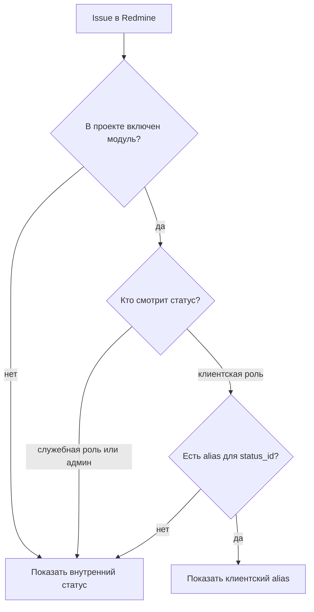

# Redmine Status Alias


`redmine_status_alias` показывает клиентам выбранные внешние названия статусов обращений, не меняя реальные статусы Redmine, workflow, `status_id`, историю и отчетность.

> [!IMPORTANT]
> Плагин предназначен для Портала ТП на обычном интерфейсе Redmine. Клиент работает с реальными статусами Redmine, но видит их клиентские названия в основных точках интерфейса и стандартных email-уведомлениях Redmine.

## Оглавление

| Раздел | Что внутри |
| --- | --- |
| [Назначение](#назначение) | зачем нужен плагин |
| [Тезисный функционал](#тезисный-функционал) | краткий список возможностей |
| [Риски и решения](#риски-и-решения) | что может пойти не так и как это закрыто |
| [Совместимость](#совместимость) | версии Redmine и особенности установки |
| [Установка](#установка) | команды подключения плагина |
| [Настройка](#настройка) | глобальные настройки и включение в проекте |
| [Как это работает](#как-это-работает) | логика применения alias-статуса |
| [Покрытие интерфейсов](#покрытие-интерфейсов) | где именно подменяется отображение |
| [Проверка после установки](#проверка-после-установки) | приемочный checklist |
| [Важные ограничения](#важные-ограничения) | правила эксплуатации |

## Назначение

Во внутреннем процессе технической поддержки статусы Redmine могут быть слишком детальными для клиента. Например:

| Внутренний статус | Клиентское отображение |
| --- | --- |
| `Диагностика у 2 линии` | `В работе` |
| `Ожидает релиза` | `Решение подготовлено` |
| `Возврат на анализ` | `В работе` |

Плагин позволяет администратору настроить соответствие между внутренним статусом и статусом, который видит клиент. Alias выбирается из уже существующих статусов Redmine.

## Тезисный функционал

- [x] Показывает клиентам alias-названия вместо внутренних статусов.
- [x] Использует только существующие статусы Redmine в качестве клиентских alias.
- [x] Хранит общий маппинг статусов, но применяет его только в выбранных проектах.
- [x] Включается через стандартный проектный модуль `Клиентские алиасы статусов`.
- [x] Позволяет задать клиентские роли и служебные роли без alias-подмены.
- [x] Позволяет клиентам менять статус через стандартный workflow Redmine.
- [x] Не меняет реальные `status_id`, workflow, журнал, отчеты и бизнес-логику Redmine.
- [x] Покрывает стандартный UI, историю и email-уведомления Redmine.

## Риски и решения

| Риск | Как решено | Контроль |
| --- | --- | --- |
| Внутренний статус попадет клиенту | Подмена идет в основных точках Redmine UI, истории и email Redmine | Проверить карточку, список, историю, уведомления |
| Плагин применится в лишнем проекте | Alias работает только при включенном проектном модуле | `Проект -> Настройки -> Модули` |
| У пользователя есть клиентская и служебная роль | Служебные роли имеют приоритет и отключают alias | Настройка `Служебные роли без алиасов` |
| Нарушится workflow | Плагин не меняет `status_id`, только отображаемое имя | Проверить переходы workflow Redmine |
| Один alias выбран для нескольких внутренних статусов | Плагин предупреждает администратора | Предупреждение на странице настроек |
| Alias-статус удален из Redmine | Плагин предупреждает и возвращает внутреннее имя до исправления | Предупреждение на странице настроек |

> [!WARNING]
> Если несколько внутренних статусов отображаются одним клиентским alias, в формах смены статуса клиент может увидеть одинаковые пункты. Для клиентских workflow лучше оставлять однозначные переходы.

## Совместимость

| Компонент | Требование |
| --- | --- |
| Redmine | `6.0.0+` |
| Целевой стенд | `6.0.5` |
| Ruby/Rails | версии из установленного Redmine |
| Миграции БД | не требуются |
| Основной UI | обычный интерфейс Redmine |

## Установка

Скопируйте или клонируйте репозиторий в каталог плагинов Redmine:

```bash
cd /path/to/redmine/plugins
git clone git@github.com:vatest021-ctrl/redmine-status-alias.git redmine_status_alias
```

Перезапустите Redmine. Миграции не требуются, но стандартную команду можно выполнить безопасно:

```bash
cd /path/to/redmine
bundle exec rails redmine:plugins:migrate RAILS_ENV=production
```

<details>
<summary>Подключение на тестовом стенде через скрипты</summary>

```bash
cd /path/to/redmine_status_alias
sudo scripts/link_to_redmine.sh /home/red2mine/20240627/red2mine
sudo scripts/migrate_plugin.sh /home/red2mine/20240627/red2mine
```

После подключения перезапустите Rails/Passenger/Puma-процесс Redmine.

</details>

## Настройка

### Глобальные настройки

Откройте:

```text
Администрирование -> Модули -> Redmine Status Alias -> Настроить
```

Настройте:

1. `Клиентские роли`: пользователи этих ролей будут видеть alias-статусы.
2. `Служебные роли без алиасов`: эти роли всегда видят внутренние статусы.
3. `Соответствие статусов`: внутренний статус Redmine -> клиентский статус Redmine.

### Включение в проекте

Затем включите модуль только в нужных проектах:

```text
Проект -> Настройки -> Модули -> Клиентские алиасы статусов
```

> [!NOTE]
> Администраторы всегда видят исходные внутренние статусы.

## Как это работает

Плагин регистрирует проектный модуль `status_alias`. Alias-статусы применяются только для задач тех проектов, где этот модуль включен.



Технически плагин подключает небольшие patch'и к точкам Redmine, где отображаются статусы. `Issue#status` передает проектный контекст, а `IssueStatus#name` возвращает alias только при выполнении условий:

- в проекте включен модуль `Клиентские алиасы статусов`;
- текущий пользователь имеет клиентскую роль в этом проекте;
- у текущего пользователя нет служебной роли без alias;
- для внутреннего статуса задан alias.

## Покрытие интерфейсов

| Поверхность | Статус |
| --- | --- |
| Карточка задачи | покрыто |
| Список задач и query columns | покрыто |
| Форма редактирования задачи | покрыто |
| Массовое редактирование | покрыто |
| Контекстное меню смены статуса | покрыто |
| Фильтры по статусу | покрыто |
| История изменений статуса | покрыто |
| Email-уведомления Redmine | покрыто |
| Проектные отчеты | покрыто |
| CSV/PDF-выгрузки через query columns | покрыто |

Клиент выбирает в форме реальные статусы Redmine, но видит клиентские названия. Workflow Redmine остается источником правды: если клиент может менять статус, это должно быть разрешено стандартными правилами workflow для его роли.

## Проверка после установки

- [ ] Включить проектный модуль `Клиентские алиасы статусов`.
- [ ] Настроить клиентскую роль.
- [ ] Настроить служебную роль без alias, если у сотрудников бывают смешанные роли.
- [ ] Настроить соответствие внутренних статусов клиентским.
- [ ] Проверить карточку задачи клиентским пользователем.
- [ ] Проверить список задач и фильтр по статусу.
- [ ] Проверить форму смены статуса и контекстное меню.
- [ ] Изменить статус и проверить историю.
- [ ] Проверить email-уведомление.
- [ ] Проверить проект без включенного модуля.
- [ ] Проверить администратора и служебную роль.

## Важные ограничения

> [!IMPORTANT]
> Глобальные настройки задают только роли и соответствия статусов. Само применение включается отдельно в каждом проекте через стандартную вкладку модулей Redmine.

<details>
<summary>Почему workflow и отчеты остаются корректными</summary>

Плагин не меняет `status_id` задачи и не создает альтернативный workflow. Все переходы, фильтры, отчеты и история продолжают работать по реальным статусам Redmine. Меняется только строковое отображение имени статуса для выбранной аудитории.

</details>

<details>
<summary>Что делать с одинаковыми alias-статусами</summary>

В списках одинаковые alias допустимы. В формах смены статуса они могут выглядеть неоднозначно, потому что за одинаковым текстом стоят разные реальные `status_id`. Если клиент должен менять статус сам, лучше проектировать workflow так, чтобы доступные клиенту переходы имели разные видимые названия.

</details>
